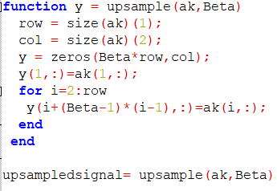
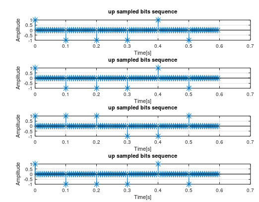

 <h1>Techniques de transmission et traitement du signal :   
Simulation d'une chaine de transmission
 </h1> 

<h2> Simulation de l'emetteur</h2>
<h3> Génération des messages aléatoires</h3>

La fonction d'un émetteur est d'envoyer un signal analogique capable de se propager correctement sur le canal physique, occupant la bande de fréquence souhaitée, et ayant le niveau de puissance souhaité, en fonction des bits d'information fournis à son entrée.

Le message à transmettre prend la forme d'une trame de M bits : xn(k) = 0/1 où k ∈ [0 · · M - 1]. Le débit est de R bits/s, c'est-à-dire que la durée de chaque bit est de Tb = 1R secondes. La séquence

Les bits 0 auront une amplitude de -1 et les bits 1 auront une amplitude de 1.

Sur Matlab cette séquence est génerée de la manière suivante :

La fonction rand genere un nombre aléatoire entre  0 et 1 . La fonction round donc arrondi ce nobmre soit a 0 soit a 1. 

le résultat donc est une matrice de N colonnes represantans le nombre de séquence; et de M lignes représantant le nombre d'élements dans une séquence 

l'affichage se fait de la manière suivante:

 Et donne le résultat suivant pour 6 séquence d'une trame de 8 bits :

les signaux a transmettre doivent etre surechantilloné selon le critère de Shanon

les séquences echantillonés seront de la forme suivante

