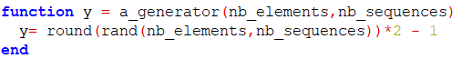
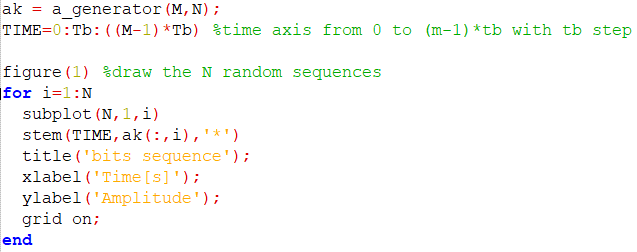
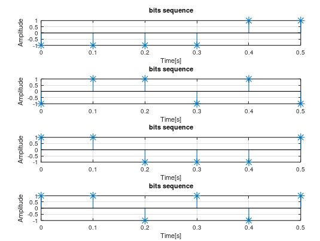
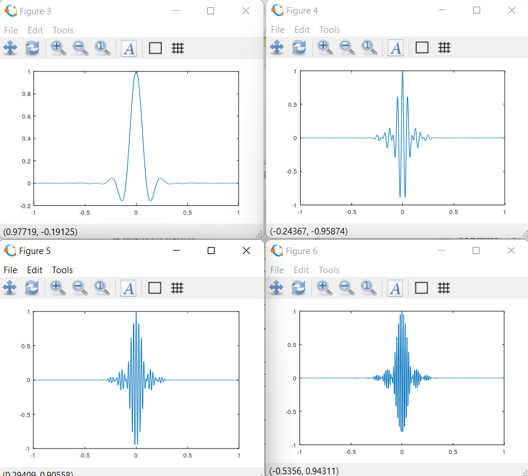
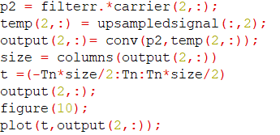
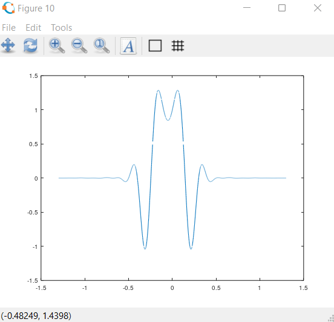

 <h1>Techniques de transmission et traitement du signal :   
Simulation d'une chaine de transmission
 </h1> 

<h2  style="color:cyan"> Simulation de l'emetteur</h2>
<h3 style="color:pink"> Génération des messages aléatoires</h3>

La fonction d'un émetteur est d'envoyer un signal analogique capable de se propager correctement sur le canal physique, occupant la bande de fréquence souhaitée, et ayant le niveau de puissance souhaité, en fonction des bits d'information fournis à son entrée.

Le message à transmettre prend la forme d'une trame de M bits : xn(k) = 0/1 où k ∈ [0 · · M - 1]. Le débit est de R bits/s, c'est-à-dire que la durée de chaque bit est de Tb = 1R secondes. La séquence

Les bits 0 auront une amplitude de -1 et les bits 1 auront une amplitude de 1.

Sur Matlab cette séquence est génerée de la manière suivante :

La fonction rand genere un nombre aléatoire entre  0 et 1 . La fonction round donc arrondi ce nobmre soit a 0 soit a 1. 

le résultat donc est une matrice de N colonnes represantans le nombre de séquence; et de M lignes représantant le nombre d'élements dans une séquence 

l'affichage se fait de la manière suivante:

 Et donne le résultat suivant pour 6 séquences d'une trame de 8 bits :

les signaux a transmettre doivent etre surechantilloné selon le critère de Shanon. voici ci dessous la fonction implémentée pour réaliser le surechantilonage

les séquences echantillonés seront de la forme suivante

<h3 style="color:pink" > Génération des Porteuses Pn</h3>

le filtre de Nyquist choisi est un filtre en cosinus surélevé avec un facteur de descente alpha compris entre 0 et 1.

Pour réaliser la version numérique de ce filtre, on utilise la fonction rcosfir de MATLAB 

Ensuite, pour avoir un filtre pour chaque séquence de bits, il faut ramener ce filtre a  N differente fréquences pour pouvoir les transmettre indépendemment.  

Ce qui fournit les porteuse Pn suivantes :

<h3 style="color:pink" > Produit de convolution</h3>

La convolution en domaine temporelle est fait gràce à la fonction conv de matlab

  
Et ça donne le résultat suivant pour la deuxième séquence 

  